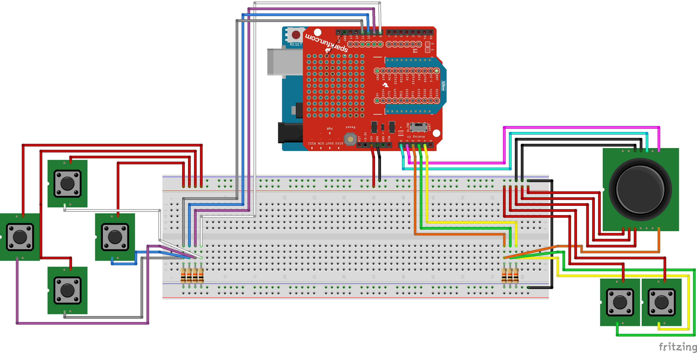

saxc-controller-transceiver
===========================

Simple Arduino XBEE controller - remote control module

## Hardware ##

* Arduino Uno (or 328p based)
* XBEE Shield
* XBEE module
* Six push button
* One joystick

Fritzing schematic, see ``brd/`` folder.

## Software ##

Arduino program, see ``src/`` folder.

